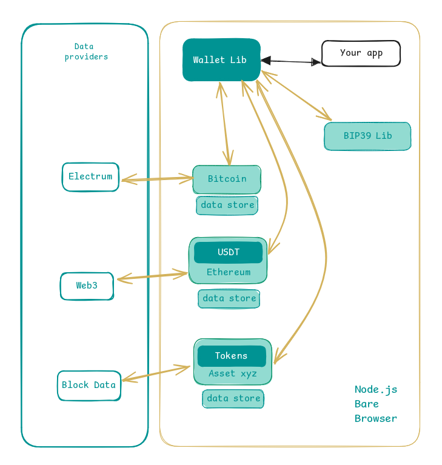

# Wallet Lib

Multi asset cryptocurrency wallet library in JavaScript.
Supported on 3 platforms:  Node.js, Browser, Bare Runtime


# Features

- **Non custodial:** not your keys, not your coins.
- **Composable:** Single facade to interact with multiple assets and wallets
- **Modular:** All components are modular and can be used independently.
- **Extensible:** Easily add new asset, seed source, block source...etc

### Architecture


### Default Components and assets

- `wallet-seed-bip39` - BIP39 seed generation library.
- `wallet-store-hyperbee` - Hyperbee data store for wallet.
- `wallet-pay-btc` - Bitcoin payment asset with Electrum backend. 
- `wallet-pay-eth` - Ethereum and ERC20 payment asset with Web3 backend and custom blocksource
- `lib-wallet-indexer-eth` - Ethereum indexer backend.
- `wallet-test-tools` - Tools for development and testing 

### Example Usage

```javascript

  const seed = await BIP39Seed.generate(/** seed phrase or leave empty to generate one */)

  // Setup wallet store. Modular data store for  writing data
  const store = new WalletStoreHyperbee({
    store_path: './wallet-store' // Leave empty to use in-memory store
  })

  // Setup Bitcoin asset
  const btcPay = new BitcoinPay({
    // Asset name is used to identify the asset in the wallet.
    // You can have multiple assets of same currency
    asset_name: 'btc',
    // Bitcoin network you'll be using
    network: 'regtest'
  })

  // Setup main wallet class
  const wallet = new Wallet({
    store,
    seed,
    // List of assets 
    assets: [ btcPay, ]
  })

  // Start wallet and initialize
  // Connect to block source 
  // Add asset to wallet registry 
  await wallet.initialize()

  // Traverse wallet history of all assets and sync them. This might take a while depending on wallet size 
  await wallet.syncHistory(opts)

  // Get a new bitcoin address using api below
  const btcAddress = await wallet.pay.btc.getNewAddress()

  // Get Tx history

  await wallet.pay.btc.getTransactions((tx) =>{}
    // do something here 
  }))
  //done 

```

### Seashell Example app
Example app supporting 3 platforms

- Node.js
- Bare runtime
- Web
Webpack.config.js has been provided to allow you to build for the browser.

[Go here](./example)

### Development Requirements
- [Bitcoin Core running Regtest](https://developer.bitcoin.org/examples/testing.html)
- [ElectrumX](https://electrumx-spesmilo.readthedocs.io/en/latest/)
- [Ethereum HardHat](https://hardhat.org/hardhat-network/docs/overview)

