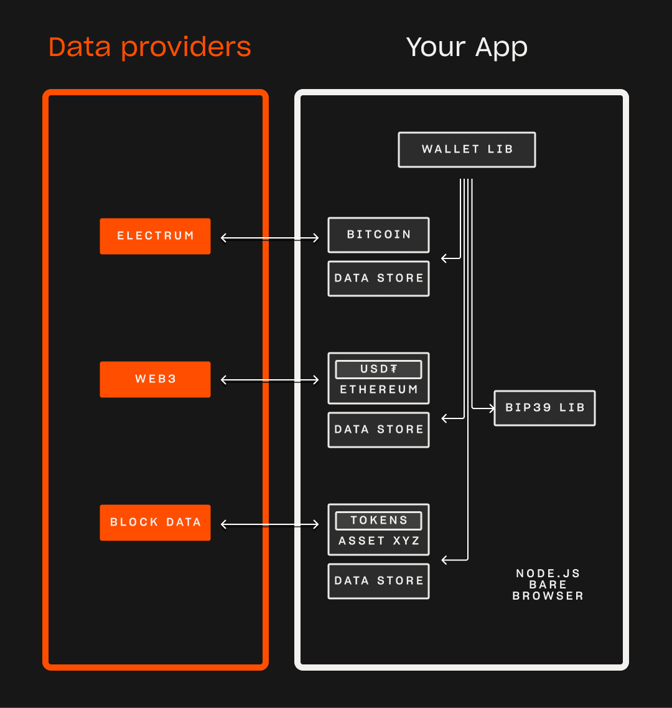

# Wallet Lib

Multi asset cryptocurrency wallet library in JavaScript.
Supported on 3 platforms:  Node.js, Browser, Bare Runtime


## ⭐ Features

- **Non custodial:** not your keys, not your coins.
- **Composable:** Single facade to interact with multiple assets and wallets
- **Modular:** All components are modular and can be used independently.
- **Extensible:** Easily add new asset, seed source, block source...etc

## 🔗 Blockchains

### [Bitcoin](https://github.com/tetherto/lib-wallet-pay-btc)
- Electrum block data source. Support for TCP and Websocket on browser. 
- P2WPKH / BIP84 address support.

### [USDT-Ethereum](https://github.com/tetherto/lib-wallet-pay-eth)
- Web3 and [Indexer](https://github.com/tetherto/lib-wallet-indexer) block data source.
- ERC20 support.
- BIP44 address generation.

**addtional support coming soon**


### 🏗️ Architecture


### 🧩 Components
The wallet comes with all the components needed to build a wallet. You can also use these as an example to build your own components.

- [BIP39 Seed](https://github.com/tetherto/lib-wallet-seed-bip39): Generate BIP39 seed for all assets 
- [Key value store](https://github.com/tetherto/lib-wallet-store): Store transaction history and track state.
- [Blockchain indexer](https://github.com/tetherto/lib-wallet-indexer): Remote blockchain data provider
- [Test tools](https://github.com/tetherto/wallet-lib-test-tools): Tools for development and testing 

### **</>**  Example Usage

```javascript

  const seed = await BIP39Seed.generate(/** seed phrase or leave empty to generate one */)

  // Setup wallet store. Modular data store for  writing data
  const store = new WalletStoreHyperbee({
    store_path: './wallet-store' // Leave empty to use in-memory store
  })

  // Setup Bitcoin asset
  const btcPay = new BitcoinPay({
    // Asset name is used to identify the asset in the wallet.
    // You can have multiple assets of same currency
    asset_name: 'btc',
    // Bitcoin network you'll be using
    network: 'regtest'
  })

  // Setup main wallet class
  const wallet = new Wallet({
    store,
    seed,
    // List of assets 
    assets: [ btcPay, ]
  })

  // Start wallet and initialize
  // Connect to block source 
  // Add asset to wallet registry 
  await wallet.initialize()

  // Traverse wallet history of all assets and sync them. This might take a while depending on wallet size 
  await wallet.syncHistory(opts)

  // Get a new bitcoin address using api below
  const btcAddress = await wallet.pay.btc.getNewAddress()

  // Get Tx history

  await wallet.pay.btc.getTransactions((tx) =>{}
    // do something here 
  }))
  //done 

```

## 🐚 Seashell Example Wallet
There is a working example wallet that supports:
- [Node.js cli wallet](./example/node)
- [Bare runtime cli wallet](./example/node)
- [Browser web wallet](./example/web)


## 🛠️ Development and testing
- [Bitcoin Core running Regtest](https://developer.bitcoin.org/examples/testing.html)
- [ElectrumX](https://electrumx-spesmilo.readthedocs.io/en/latest/)
- [Ethereum HardHat](https://hardhat.org/hardhat-network/docs/overview)

